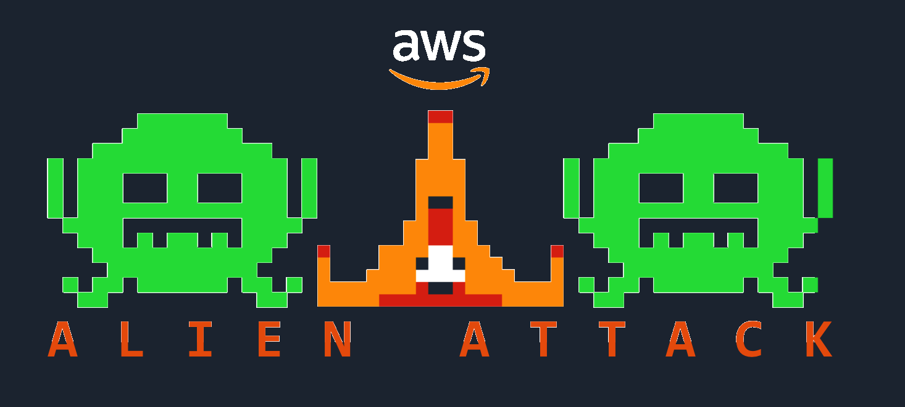

# 

**DISCLAIMER:** AWS Alien Attack, and all its complementary resources are provided without any guarantees, and you're not recommended to use it for production-grade workloads. The intention is to provide content to build and learn. Be sure of reading the licensing terms.

## What is AWS Alien Attack?

AWS Alien Attack is a serverless learn-by-building adventure, where you can test and think about different aspects of serverless architectures for near real-time data processing pipelines on AWS. 

You can use Alien Attack to think, exercise, discuss, and talk about best practices for development, security, databases, Big Data, IoT, and so on.

This repository contains a collection of assets that will help you to implement and explore the different perspectives of this application, in the light of the [Well-Architected Framework](https://aws.amazon.com/architecture/well-architected/).

## Where are the instructions to build this?

The instructions to run this workshop are on the official page of the [AWS Alien Attack Workshop](https://alienattack.workshop.aws). You can go through the instructions alone, but for a richer experience we recommend to have it run by an AWS SA or by an AWS Partner.

Customers and [AWS Partners](https://aws.amazon.com/partners/) willing to schedule a private session (20+ attendees) should contact their respective Account Manager (AM), Partner Development Manager (PDM), AWS Solutions Architect (SA) or AWS Partner Solution Architect (PSA). The Immersion Day is delivered at no cost.

Be aware that some parts of this workshop might not be well-architected at this point, intentionally, to provide opportunity for you exercise the discovery and resolution of those issues, alone or working with an AWS SAs or with AWS Partners.

## What do we have here?

* The [Infrastructure](infrastructure) folder provides what is required for you to deploy the back-end of the system. This is the first part that you want to run, as it is going to build the infrastructure and provide parameters required to configure the front-end application.

* The [Application](application) foder is where we have the code for this front-end of Alien Attack. It provides resources both for the Gamer (the ones generating data to the cloud by playing the game) and for the Manager (the ones creating session and consuming data) user profiles. 

## License

This sample code is licensed under the MIT-0 License. See the LICENSE file.