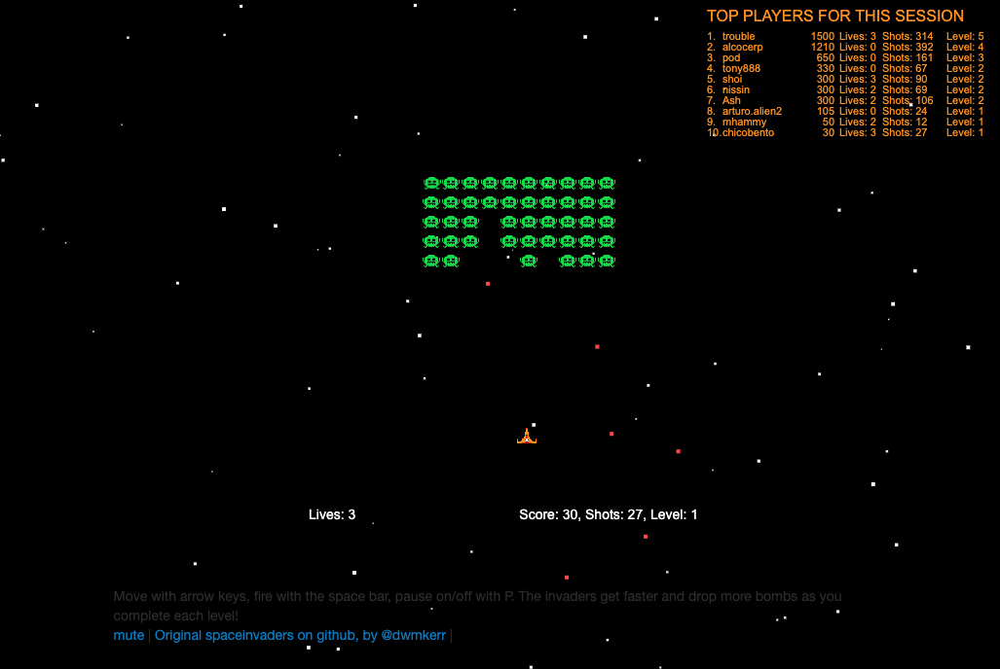
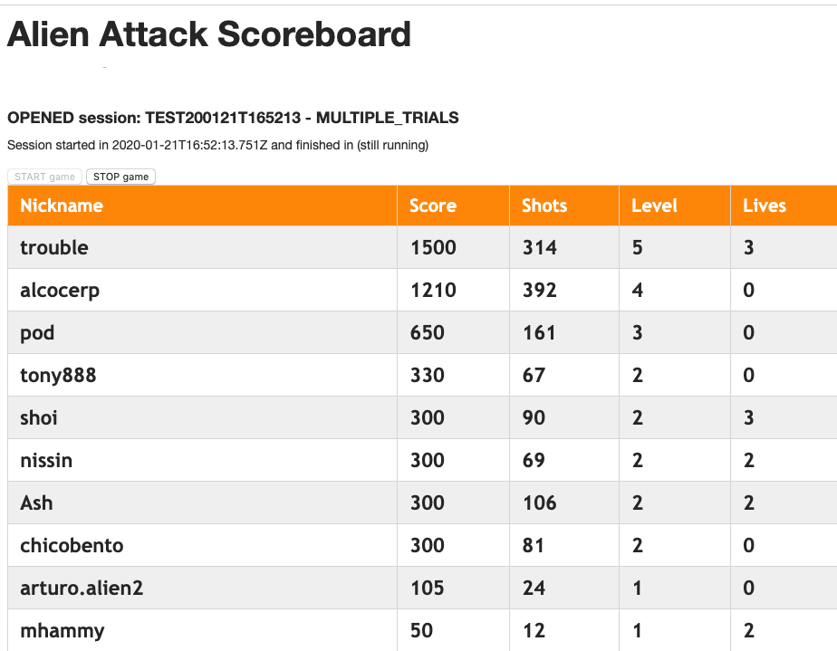

# AWS Alien Attack - Application

This is the front-end for AWS Alien Attack.

It provides the resources to deploy two applications: The Gamer, and the Manager.

## The Gamer application

Here we have the multi-player game. It provides functionalities for sign-on, sign-in, it presents a Top 10 scoreboard so the gamers can track how they are performing and, of course, the game experience. 

While playing, the gamers are uploading their status to the cloud, which is processed and then feeds the main scoreboard, provide data to other consumers, and to the other parts of the architecture.

It can be accessed via the path `/game/index.html` on your deployment URL.

## The Manager application

The Manager application provides mechanisms to the manager to open and close game sessions and, while running a session, it allows the manager to present the full scoreboard.

It can be accessed via the path `/scoreboard/index.html` on your deployment URL.

## How to deploy it

To run the front-end, first you need to deploy the back-end, which can be created by following the instructions at the [infrastructure deployment folder](./../infrastructure).

After deploying the back-end, you will get the necessary data to update the file `./resources/js/aws-config` which connects the front-end to the back-end:

~~~
const DEBUG = true;
const AWS_CONFIG = {
    "region" : <region used for the deployment>,
    "API_ENDPOINT" : <URL for the prod stage of the API. Include /v1 at the end>,
    "APPNAME" : <name of the app used at deployment time> 
}
~~~

Be sure of reading the instructions at the [AWS Alien Attack Workshop](https://alienattack.workshop.aws). We provide a guidance on how to deploy it properly.