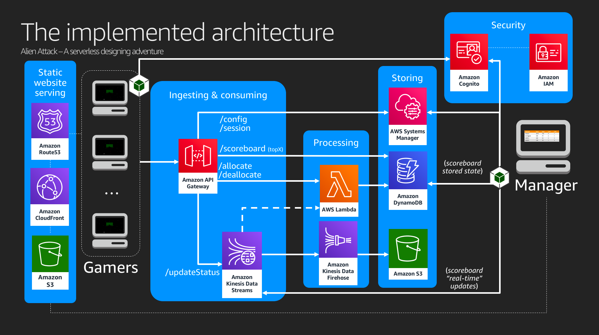

# AWS Alien Attack - Infrastructure

These are the resources that you need to deploy the back-end for AWS Alien Attack. The deployment will provide the required parameters for the configuration of the [front-end applications](./../application): the game console, and the manager console.

# What is going to be deployed?

The architecture to be deployed is the one pictured below. 

But, wait! 

Not everything is going to be deployed - nor is coded - perfectly. As it happens in the real-life, mistakes happen, things break, and sometimes we are the ones in charge of fixing them.

# How to deploy it?

We recommend you to follow the step-by-step guidance on the [AWS Alien Attack Workshop](https://alienattack.workshop.aws) website. Great opportunity for learning what you are doing. Even better if you do it with the guidance of an AWS or AWS Partner SA. 

However, if you want to do it without going through the workshop, we provide here the steps.

The back-end deployment is supported by CDK. To make the things easier - and to not affect your computer by installing tools that you migh not need, we recommend Cloud9 or another Amazon Linux instance which you can access via SSH.

1. Be sure that your machine has the permissions in place to deploy the Cloudformation template.

2. Clone the repository in the machine.

3. Get into the *infrastructure* folder

~~~
cd infrastructure
~~~

4. Install the dependencies

~~~
source ./config.sh
~~~

5. Get into the *cdk* folder

~~~
cd cdk
~~~

6. Compile the code

~~~
npm run build
~~~

7. (Optional) Check the generated CloudFormation template.

~~~
cdk synth -c envname=$envname -c sessionparameter=true -c kinesisintegration=true -c firehose=true -c deploycdn=true
~~~

5. Deploy the code using CDK

The comand below deploys the whole environment, but that's not the ideal way of deploying it if you want to learn about the architecture. If you really want to learn, ask for a workshop session for your company (delivered by an AWS SA or AWS Partner).

Another relevant point: If you do not want to deploy the Cloudfront distribution - it takes a few minutes to be deployed - be sure of removing the parameter *-c deploycdn=true* from the command below.

~~~
cdk deploy -c envname=$envname -c sessionparameter=true -c kinesisintegration=true -c firehose=true -c deploycdn=true
~~~

# How much is this going to cost?

AWS Alien Attack runs at a very low cost during game time - approximately US$ 0.10/user/hour (ten cents, per user, per hour).

While there is no session in progress, the cost will be around US$ 11.00/month (in total), not included the costs with storage (The costs with DynamoDB and S3 will depend on how much data do you have there). 

However, you can make this architecture totally ephemeral, by destroying and rebuilding everything when needed (including the database).

The cost estimate considers the environment deployed in us-east-1, and prices corresponding to December 2019.

Check more details about the services/products used by expanding this section below.

By the way, would you like to confirm if that's the real cost? Want to do some math yourself?

List of used services

* **CDK**: AWS Alien Attack was built using CDK for the infrastructure deployment. To know more about CDK, check [what is CDK](https://docs.aws.amazon.com/CDK/latest/userguide/what-is.html), and visit its [github repository](https://github.com/awslabs/aws-cdk). Also, take some time to explore this [workshop](https://cdkworkshop.com/).
* **Cloud9**: Cloud9 it will be your "development environment". To know more about Cloud9, including pricing, click [here](https://aws.amazon.com/cloud9/). Cloud9 provides free tier.
* **Amazon Cognito**: Cognito is the service that we are using to provide identification and authentication services to AWS Alien Attack. To know more about Cognito, including pricing, click [here](https://aws.amazon.com/cognito/). Cognito provides free tier.
* **Amazon Identity and Access Management (IAM)**: IAM is a service that allows ytou to create and manage acess to AWS resources, and for Alien Attack we are using roles and polices alongside Cognito to provide the proper authorizations to the users. So, with Cognito and IAM, we cover identification, authentication, and authorization using RBAC (Role-Based Access Control). To learn more about IAM, go [here](https://aws.amazon.com/iam/). IAM is free.
* **Amazon S3**: S3 is used to host the website and to store the raw incoming data for analytics purposes. Read more about it [here](https://aws.amazon.com/s3/). S3 provides free tier.
* **Amazon API Gateway**: API Gateway will be the interface between the gamer and the back-end. To know more about it, go [here](https://aws.amazon.com/api-gateway/). API Gateway provides free tier.
* **AWS Lambda**: Lambda is the foundation for our processing layer. It allows you to run code without having to provision servers. To know more about it go [here](https://aws.amazon.com/lambda/). Lambda provides free tier.
* **Amazon Kinesis Data Stream**: Is the service that we use for ingesting streaming data. To know more about Kinesis Data Stream, including pricing, click [here](https://aws.amazon.com/kinesis/data-streams/). Kinesis Data Streams *has not free tier* , but the cost for this application, for 1 user, the cost associated to Kinesis Data Streams it will be of 1 cent per hour approximately.
* **Amazon Kinesis Data Firehose**: Amazon Kinesis Data Firehose is the easiest way to load streaming data into data stores and analytics tools. It can capture, transform, and load streaming data into Amazon S3, Amazon Redshift, Amazon Elasticsearch Service, and Splunk, enabling near real-time analytics with existing business intelligence tools and dashboards you’re already using today.  We are using it to drop data from Kinesis Data Streams to To know more about Kinesis Data Firehose, including pricing, click [here](https://aws.amazon.com/kinesis/data-firehose/). Kinesis Data Firehose *has not free tier* , but the cost for testing this application will be neglectable. Check the pricing model to learn more.
* **Amazon DynamoDB**: Is the database that we are using to store the scoreboard data for the game sessions. Amazon DynamoDB is s a key-value and document database that delivers single-digit millisecond performance at any scale. It's a fully managed, multiregion, multimaster database with built-in security, backup and restore, and in-memory caching for internet-scale applications. DynamoDB can handle more than 10 trillion requests per day and support peaks of more than 20 million requests per second. DynamoDB provides free tier, and we will be running under it for Alien Attack. To learn more about it, visit [this link](https://aws.amazon.com/dynamodb/).
* **AWS Systems Manager**: Systems Manager provides a unified user interface so you can view operational data from multiple AWS services and allows you to automate operational tasks across your AWS resources. We are using the [Parameter Store](https://aws.amazon.com/systems-manager/features/#Parameter_Store) feature of Systems Manager, which provides a centralized store to manage your configuration data, whether plain-text data such as database strings or secrets such as passwords. To know more about Systems Manager, including pricing, click [here](https://aws.amazon.com/systems-manager/).  Parameter store is free.
* At the *programming* side, we are using [AWS SDK for Javascript in the Browser](https://aws.amazon.com/sdk-for-browser/) and [AWS SDK for node](https://aws.amazon.com/sdk-for-node-js/). Alien Attack was not developed using the best practices, exaclty because one of the workshops is about fixing it and applying the best practices for programming and DevSecOps.

# How to tear down the environment

if you have followed the workshop instructions on the [workshop website](https://alienattack.workshop.aws), there you will going to find guidance on how to tear down the environment.  

If you have done the deployment by yourself, be sure of undoing the changes that you have done by hand on your environment, and then run the following command. It will destroy your enviroment.

~~~
cdk destroy -c envname=$envname
~~~

Be aware that, in any case, the S3 buckets will not be removed. You need to remove them by hand.

**`WARNING:`** Deleting these buckets is an irreversible operation. 

To remove the **RAW bucket** (used to store the incoming data), execute the following command:
~~~
aws s3 rb s3://${envnameLowercase}.raw --force
~~~

To remove the **APP bucket** (used to store the application), execute the following command:
~~~
aws s3 rb s3://${envnameLowercase}.app --force
~~~